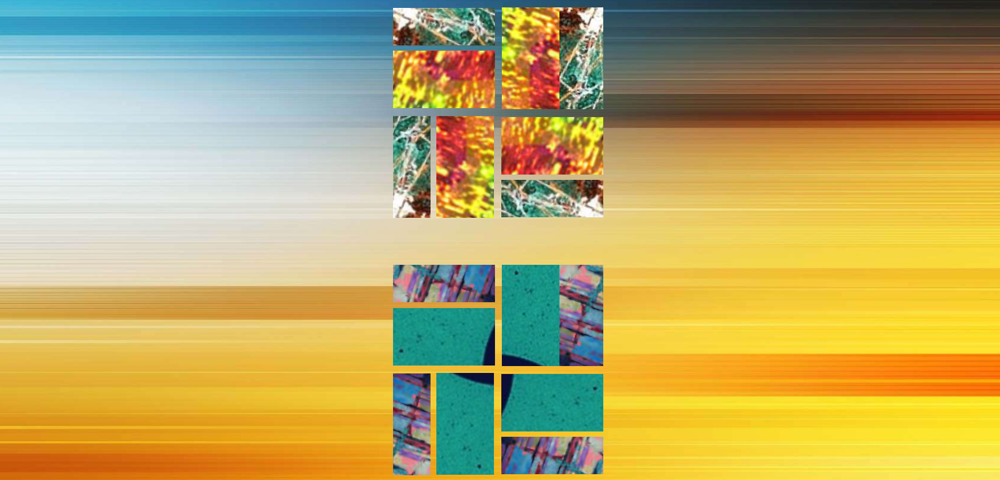

<h1>7 MILLION PAINTINGS</h1>

<a href="https://sevenmillionpaintings.herokuapp.com/"
  target="blank">https://sevenmillionpaintings.herokuapp.com/</a>
   
   

  
   

  
Welcome to 7 MILLION PAINTINGS!  This app takes specific curated images from the
  internet and composites them together to create a brand new piece of art to view and save.
  

  
API built on node. for user management and for gallery saving and updates

  
App built using React for frontend

   

  

  
This is a demo project and not a production.

